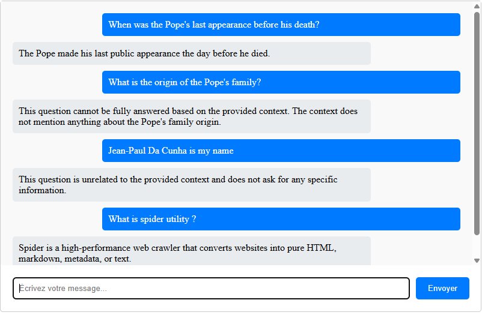

# Lang Chain POCS
Pocking lang chain using javascript, Ollama, and Grocq

## Pocs description

* Etape 1 : Technical stack setup
* Etape 2 : Interacting with LLM (difference between stream and invoke)
* Etape 3 : Using prompt templates sample
* Etape 4 : Output parsers
* Etape 5 : non determistic parsers problem improvement
* Etape 6 : First RAG sample using hardcoded document
* Etape 7 : RAG using document loaded from URL
* Etape 8 : RAG using document loaded PDF. Debugguing splitter script
* Etape 9 : Keep conversation history during RAG
* Etape 10 : Chat interface with full RAG keeping context
  * The chat model is not fully opérational because (I guess) the bad quality of generated embeddings. 
  * The context provide informations about spider (using url) and pope (using PDF).
  * Here you can find a picture of problems :
    IA is able to respond to both questions about spider and pope. IA does not provide good answers for all questions because related context chunks provided using RAG is not always the more relevant regarding the user's input.
   
    TODO :  Maybe using a larger model in ollama will help in terms of relevance

## Start a POC

### 1. Execute following command to launch a sample
```console
$ cd ./js/<SAMPLE_DIR>
$ node ./app.js
```
### 2. Additional step for Etape10_IHM :
After launching server using command above you need to launch index.html from POC's directory in your favorite browser.
