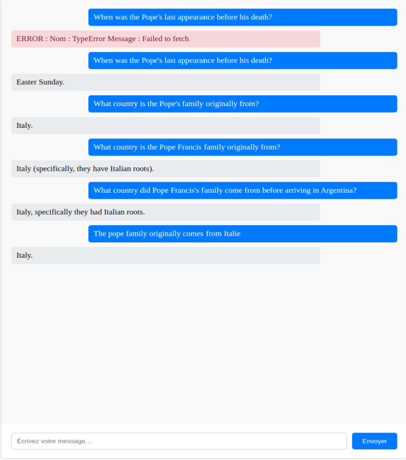

# Lang Chain POCS
Pocking lang chain using javascript, Ollama, and Grocq

## Pocs description

* Etape 1 : Technical stack setup
* Etape 2 : Interacting with LLM (difference between stream and invoke)
* Etape 3 : Using prompt templates sample
* Etape 4 : Output parsers
* Etape 5 : non determistic parsers problem improvement
* Etape 6 : First RAG sample using hardcoded document
* Etape 7 : RAG using document loaded from URL
* Etape 8 : RAG using document loaded PDF. Debugguing splitter script
* Etape 9 : Etape 8 + Keep conversation history during RAG
* Etape 10 : Etape 9 + Chat interface with full RAG keeping context
  * The chat model is not fully opérational because (I guess) the complexity of provided text
  * The context provide informations about spider (using url) and pope (using PDF).
  * Here you can find a picture of problems :
    IA is able to respond to both questions about spider and pope. IA does not provide good answers for all questions because related context chunks provided using RAG is not always the more relevant regarding the user's input.
   
    TODO :  Maybe using a larger model in ollama will help in terms of relevance
* Etape 10_2 : Etape 10 + This version provide enhancements regarding abilty of the chat to respond
  * The improvement was to enhance current document content with a simplified version ot the content generated using ollama (in order to consumme less token on GROQ)
  * Here is the compared results.

| Before improvement | After improvement |
|--------|---------|
|  |  |


## Start a POC

### 1. Installation

Be Aware about models deprecation for example initial used model **llama-3.2-3b-preview** was deprecated in 14/04/2025.

see https://console.groq.com/docs/deprecations for replacement recommandations

Most of samples were tested using

- GROQ using model : **llama-3.1-8b-instant** Don't forger to create / refresh API key for GROQ before trying to use it.
- Ollama Model for embeddings : **llama3.2:3b**

### 2. Start Ollama
See [Readme](./runtime/README.md) of docker compose to start

### 3. Execute following command to launch a sample
```console
$ cd ./js/<SAMPLE_DIR>
$ npm install
$ node ./app.js
```
### 2. Additional step for Etape10_IHM :
After launching server using command above you need to launch index.html from POC's directory in your favorite browser.
